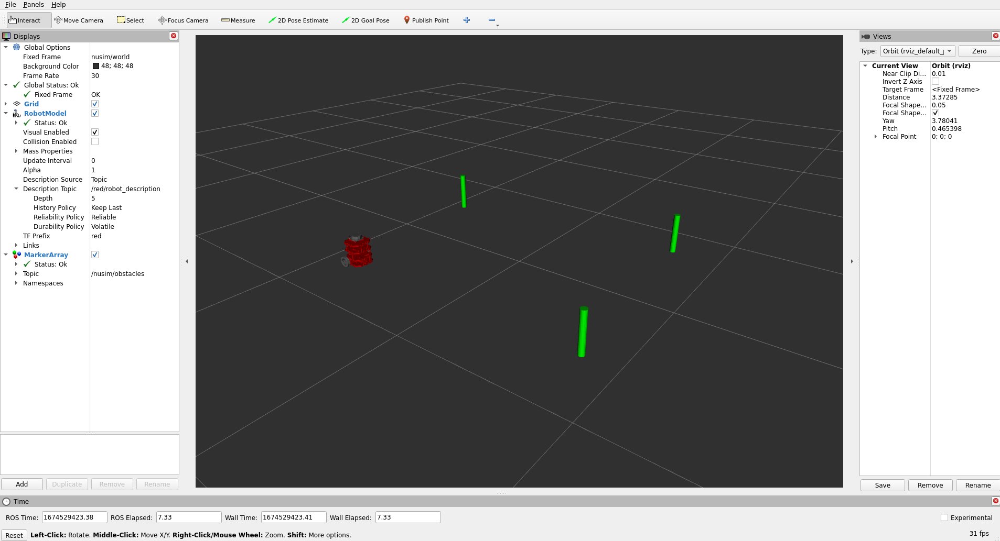

# nusim: A simulator for the turtlebot robot in ROS2

This package simulates a turtlebot robot with ROS2, using RVIZ for 
visualization. As of now, the package will place a turtlebot model 
in RVIZ at a specified pose. Additionally the user can specify an
arbitrary number of obstacles to also be placed into the
simulation/RVIZ window.

## Launchfiles

### `nusim.launch.xml`
- Starts `rviz` with configuration defined in config/nusim.rviz
- Starts the `nusim` node with parameters defined in config/basic_world.yaml
- Loads a turtlebot into `rviz` using `load_one.launch.py` from the `nuturtle_description` package

## Parameters
- `x0`: starting x location of the turtlebot in the simulator
- `y0`: starting y location of the turtlebot in the simulator
- `theta0`: starting yaw angle of the turtlebot in the simulator
- `obstacles/x`: Array of x locations of obstacles
- `obstacles/y`:  Array of y locations of obstacles
- `obstacles/r`: Radius of the obtacles 
