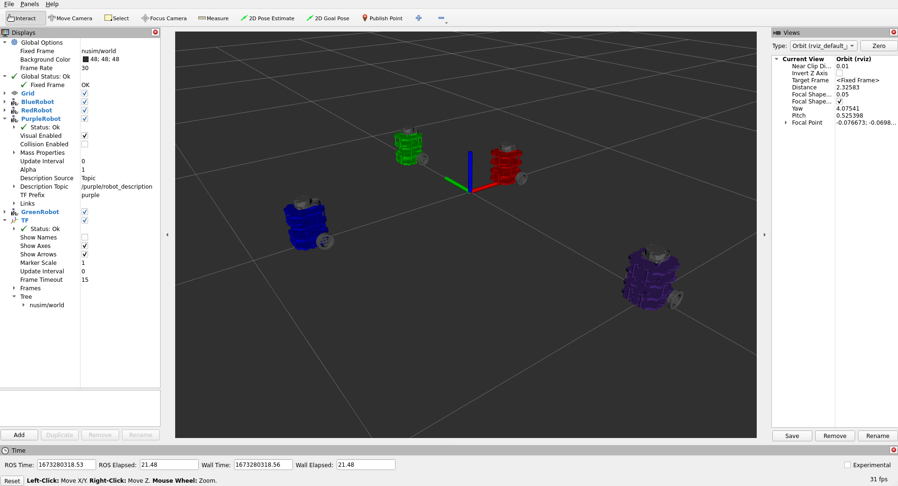

# Nuturtle  Description

URDF files for Nuturtle <NameYourRobot>
* `ros2 launch nuturtle_description load_one.launch.py` to see the robot in rviz.
* `ros2 launch nuturtle_description load_all.launch.xml` to see four copies of the robot in rviz.

* RVIZ with four robots:


* The rqt_graph when all four robots are visualized (Nodes Only, Hide Debug) is:


# Launch File Details 
## TODO: I think the load_all.launch.xml shouldn't show all the args
* `ros2 launch nuturtle_description load_one.launch.py --show-args`
    ```
    Arguments (pass arguments as '<name>:=<value>'):

        'use_jsp':
            Choose whether to use the joint state publisher
            (default: 'true')

        'use_rviz':
            Choose whether to use rviz
            (default: 'true')

        'color':
            Set the color of the robot. Valid choices are: ['purple', 'red', 'blue', 'green']
            (default: 'purple')
    ```
* `ros2 launch nuturtle_description load_all.launch.xml --show-args`
    ```
    Arguments (pass arguments as '<name>:=<value>'):

        'use_jsp':
            Choose whether to use the joint state publisher
            (default: 'true')

        'use_rviz':
            Choose whether to use rviz
            (default: 'true')

        'color':
            Set the color of the robot. Valid choices are: ['purple', 'red', 'blue', 'green']
            (default: 'purple')
    ```

Worked with: Nobody
